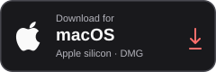
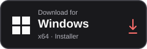
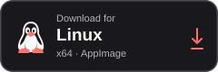
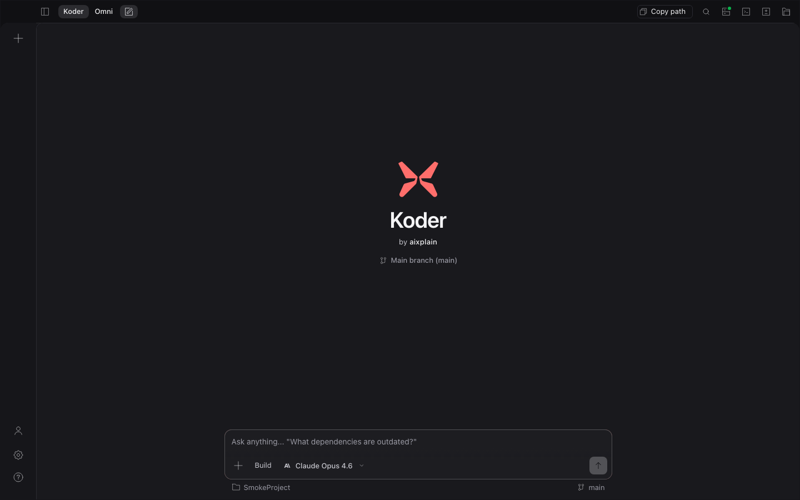
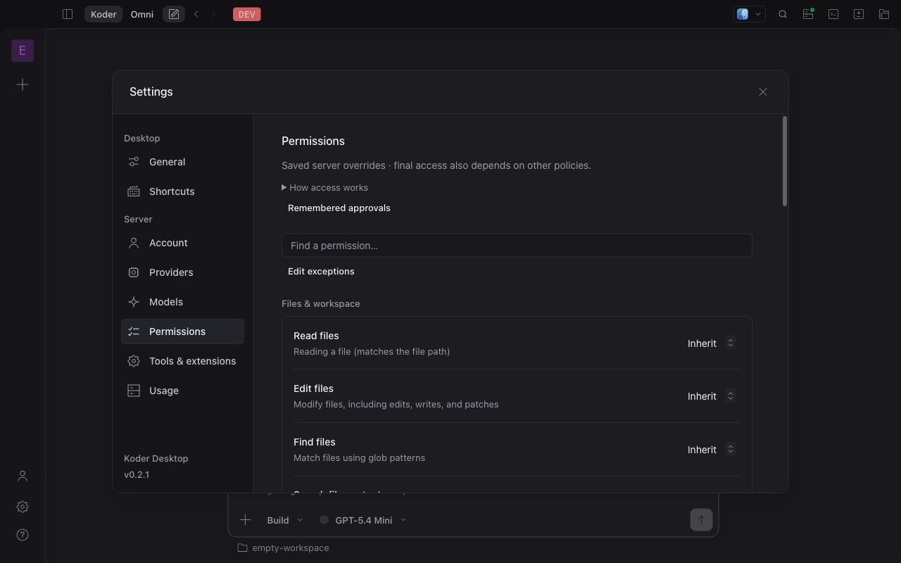
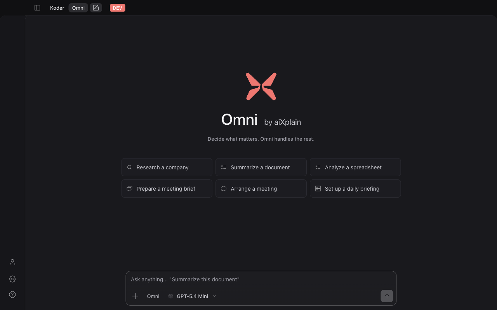

<div align="center">


# Koder

**Your models. Your tools. One coding harness.**

Plan, code, and test with aixplain, your own provider, or local models — in your terminal or desktop.

[](https://github.com/aixplain/koder/releases/latest)
[](#copyright-and-licenses)

<p align="center">
  <a href="https://github.com/aixplain/koder/releases/latest/download/aixplain-code-desktop-mac-arm64.dmg"></a>
  <a href="https://github.com/aixplain/koder/releases/latest/download/aixplain-code-desktop-win-x64.exe"></a>
  <a href="https://github.com/aixplain/koder/releases/latest/download/aixplain-code-desktop-linux-x86_64.AppImage"></a>
</p>

[Intel Mac](https://github.com/aixplain/koder/releases/latest/download/aixplain-code-desktop-mac-x64.dmg) · [Linux DEB](https://github.com/aixplain/koder/releases/latest/download/aixplain-code-desktop-linux-amd64.deb) · [Linux RPM](https://github.com/aixplain/koder/releases/latest/download/aixplain-code-desktop-linux-x86_64.rpm) · [All downloads](https://koder.aixplain.com/#download)

[Install the CLI](#install-the-cli) · [Get started](#get-started) · [How it works](#how-koder-works) · [Release notes](https://github.com/aixplain/koder/releases) · [Get help](#get-help)

</div>

Koder brings aixplain's model catalog, coding tools, and persistent sessions into a desktop app and an interactive terminal. Describe a task, follow the agent's work, answer its questions, and review the changes. Use aixplain, connect another supported model provider, or configure a local model.

## Choose your workspace

### Desktop

A workspace for conversations, project files, terminal commands, and reviewing changes.



<details>
<summary>See desktop permissions</summary>



</details>

<details>
<summary>See Omni</summary>



</details>

### Terminal

A keyboard and mouse interface for working directly in your repository, plus a CLI for scripts and automation.


*Screenshots show the development interface. See the [release notes](https://github.com/aixplain/koder/releases/latest) for features in the current download.*

## Download the desktop app

Choose your platform below, or use the [download page](https://koder.aixplain.com/#download).

| Your computer | Installer |
| --- | --- |
| macOS · Apple silicon | [Download DMG](https://github.com/aixplain/koder/releases/latest/download/aixplain-code-desktop-mac-arm64.dmg) |
| macOS · Intel | [Download DMG](https://github.com/aixplain/koder/releases/latest/download/aixplain-code-desktop-mac-x64.dmg) |
| Windows · x64 | [Download EXE](https://github.com/aixplain/koder/releases/latest/download/aixplain-code-desktop-win-x64.exe) |
| Linux · x64 | [DEB](https://github.com/aixplain/koder/releases/latest/download/aixplain-code-desktop-linux-amd64.deb) · [AppImage](https://github.com/aixplain/koder/releases/latest/download/aixplain-code-desktop-linux-x86_64.AppImage) · [RPM](https://github.com/aixplain/koder/releases/latest/download/aixplain-code-desktop-linux-x86_64.rpm) |

**Windows signing:** the v0.4.1 desktop installer is unsigned and may show an unknown-publisher or SmartScreen warning. Check the release notes for the signing status of later versions.

For CLI archives, checksums, and previous versions, see [all releases](https://github.com/aixplain/koder/releases). Linux arm64 is available as a CLI download.

## Install the CLI

**macOS and Linux**

```sh
curl -fsSL https://github.com/aixplain/koder/releases/latest/download/install | bash
```

**Windows — PowerShell**

```powershell
irm https://github.com/aixplain/koder/releases/latest/download/install.ps1 | iex
```

Use the PowerShell command on Windows. The installer places `koder` in `~/.koder/bin` and adds it to your user PATH. Open a new terminal after installation.

CLI builds are available for macOS arm64/x64, Linux arm64/x64, and Windows x64. To inspect the installer before running it, download [`install`](https://github.com/aixplain/koder/releases/latest/download/install) or [`install.ps1`](https://github.com/aixplain/koder/releases/latest/download/install.ps1).

## Get started

1. **Open a project.** Choose a folder in the desktop app, or run `koder` from your project directory.
2. **Connect a model.** Sign in to aixplain or configure a supported provider. An aixplain API key can also provide model access; account billing requires sign-in.
3. **Give it a concrete task.** Describe the outcome and any constraints. Review proposed actions, answer questions, and inspect the resulting diff.

```sh
cd your-project
koder
```

Try a task like:

> Find why this test fails, explain the cause, make the smallest fix, and run the relevant tests.

For aixplain account access from the CLI:

```sh
koder login
koder whoami
koder models
```

You can manage providers with `koder providers`. Available models and tools depend on your provider, account, and configuration.

## How Koder works

Koder's agent harness connects the model to your project, tools, permissions, and session history. The model can inspect files, propose edits, run commands, read their results, and continue working. You can interrupt the run or resume the conversation later.

| Capability | What you can do |
| --- | --- |
| **Code and test** | Read and search files, edit code, execute project commands, and inspect their output. |
| **Plan and delegate** | Use the planning agent to investigate a change, then switch to implementation. Delegate focused work to subagents. |
| **Keep context** | Resume saved sessions and provide project instructions through `AGENTS.md`. |
| **Choose models** | Use aixplain's catalog or another supported provider; select models for different tasks. |
| **Connect tools** | Add MCP servers, skills, and plugins for the tools your workflow needs. |
| **Review actions** | Configure permissions and workspace trust, inspect effective policy, and review file changes. |
| **Use credits** | View the selected team's wallet and manage billing through Stripe-hosted pages. |

Actions follow your configured permissions. Hosted models and connected services receive the inputs needed for their work; review your provider settings and tool configuration before using sensitive project data.

### Useful commands

| Command | Purpose |
| --- | --- |
| `koder run "Explain this project"` | Run a prompt from the shell. |
| `koder run --agent plan "Plan this change"` | Start a task with the planning agent. |
| `koder run --model <provider/model> "…"` | Select a model for a run. |
| `koder session list` | List saved sessions. |
| `koder import` | Import supported conversation histories. |
| `koder mcp` | Manage MCP tool connections. |
| `koder inspect` | Inspect the effective permission and policy configuration. |
| `koder stats` | View recorded usage. |
| `koder serve` | Start an HTTP server for clients and integrations. |
| `koder web` | Open the browser interface. |

Run `koder --help` or `koder <command> --help` for the options supported by your installed version.

### Team credits and billing

Open **Settings → Account** on desktop, use **`/billing`** in the terminal interface, or run:

```sh
koder billing
koder billing top-up --amount 10
koder billing add-card
```

Koder shows the selected team before opening checkout. Payment details and final confirmation stay on Stripe's hosted page. Return to Koder and refresh the wallet to see the updated balance. Managing billing requires an eligible signed-in team role; an inference API key alone does not grant billing access.

## Configuration and updates

Use `AGENTS.md` in your repository for project instructions. Global configuration normally lives in `~/.config/koder/koder.json` or `koder.jsonc`; XDG environment settings can change these paths. Sessions and other local state are stored separately under `~/.local/share/koder`.

Update the CLI and check its version:

```sh
koder upgrade
koder --version
```

Desktop users can use the app's update controls or download the current installer. Release archives include `SHA256SUMS` for checksum verification. The `aixplain-code` command remains available as a compatibility alias.

## Get help

- [Report a bug](https://github.com/aixplain/koder/issues/new/choose) with your version, operating system, reproduction steps, and expected result.
- Check the [release notes](https://github.com/aixplain/koder/releases) for fixes and known limitations.
- For security reports, email **help@aixplain.com**. Remove credentials and private project data before sharing logs or screenshots.

This repository hosts Koder's public downloads and issue tracker. Koder is developed by [aixplain](https://aixplain.com).

## Copyright and licenses

**© 2026 aixplain Inc. All rights reserved.**

This notice applies to aixplain-owned branding and original material, subject to any express license grants. Third-party and upstream components retain their respective licenses, copyright notices, and permissions. See [LICENSE](LICENSE) and the notices included with each distribution.
