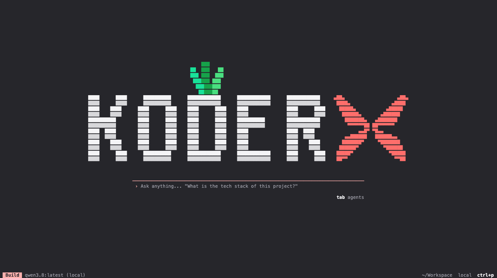

<div align="center">


# Koder

**aiXplain's agentic coding environment — your terminal, your tools, your models.**

[](https://github.com/aixplain/koder/releases/latest)
[](#platform-support)
[](LICENSE)

[Install](#install) · [First run](#first-run) · [Using it](#using-it) · [Features](#features) · [Upgrading](#upgrading-and-removing) · [Platforms](#platform-support) · [Configuration](#configuration)

</div>

Koder runs in your terminal, reads and edits the project you point it at, runs your
tools, and works against the models in your aiXplain account.



## Why Koder

- **Run any model — you're not tied to one vendor.** Claude Code speaks only to Anthropic and Codex only to OpenAI. Koder runs on the full model catalogue in your aiXplain account from a single API key, or on any provider you bring — Anthropic, OpenAI, Google, OpenRouter, local models, and more. Change models mid-session without changing tools.

- **Bring your history with you.** Coming from another tool? `koder import` pulls your past sessions in from **opencode**, **Claude Code**, and **Cursor**, so you pick up where you left off instead of starting cold.

- **One agent, wherever you work.** The same Koder runs as a fast terminal TUI, a headless server (`koder serve`) for scripts and CI, and a browser interface (`koder web`).

- **Built to extend.** Connect MCP servers for extra tools and data, run specialized subagents in parallel, and switch between agents with a single keypress.

- **Yours to run.** Open source under MIT, shipped as one signed-and-notarized binary that installs without root. Your API keys and session history stay on your machine.

## Install

```sh
curl -fsSL https://github.com/aixplain/koder/releases/latest/download/install | bash
```

Open a new terminal afterwards, then run `koder` from inside a project:

```sh
cd ~/your-project
koder
```

The installer drops a single binary in `~/.koder/bin` and adds that directory to your
shell's PATH. It does not need root, and it touches nothing else.

To install a specific version, or to skip the PATH edit:

```sh
curl -fsSL https://github.com/aixplain/koder/releases/latest/download/install | bash -s -- --version 0.3.0
curl -fsSL https://github.com/aixplain/koder/releases/latest/download/install | bash -s -- --no-modify-path
```

## First run

Koder asks for an aiXplain API key the first time it starts.

Sign in at [app.aixplain.com](https://app.aixplain.com/), open **Integrations → API
keys**, create a key and paste it in. That single key unlocks the model catalogue on
your account. It is stored under your home directory, never in your project.

If you would rather use a different provider, choose **Use a different provider** on the
same screen, or run `koder providers` later.

## Using it

Start Koder in a project and describe what you want in plain language. It reads the
files it needs, proposes edits, and runs commands when you let it.

```sh
cd ~/your-project
koder
```

### Keys worth knowing

| | |
|---|---|
| `tab` | switch agents |
| `ctrl+p` | command palette |
| `/` | slash commands (see below) |

### From the shell

| | |
|---|---|
| `koder run "…"` | one-shot: answer and exit — useful in scripts and CI |
| `koder run --model <id> "…"` | pick the model for a single turn |
| `koder models` | list the models available to you |
| `koder import` | bring sessions over from opencode, Claude Code, or Cursor |
| `koder session` | list, resume, fork and export past sessions |
| `koder stats` | token usage and spend so far |
| `koder serve` | headless HTTP server |
| `koder web` | browser interface |

`koder run` exits non-zero when a turn fails, so it composes with `&&` and CI gates.

## Features

### Models

Run the full catalogue on your aiXplain account from one API key, or bring your own
provider — Anthropic, OpenAI, Google, OpenRouter and more. Switch models mid-session
without restarting.

**Local models work out of the box.** If [Ollama](https://ollama.com) is running,
Koder finds it and offers exactly the models you have pulled — asking Ollama which
of them can hold a conversation, call tools, accept images and how much context they
have, rather than guessing. Nothing to configure; set `OLLAMA_HOST` if yours is not
on the default port.

```sh
koder run --model ollama/qwen3.5:latest "explain this repo"
```

### Agents and subagents

Switch agents with `tab`. `build` edits, `plan` investigates without touching files,
and specialised agents can run in parallel as subagents. `koder agent` manages them.

### Extending it

- **MCP servers** — `koder mcp` connects external tools and data sources.
- **Powers** — MCP servers that stay dormant until a keyword in the conversation
  wakes them, so a big toolbox costs nothing until it is wanted.
- **Workspace helpers** — scripts the agent writes for itself become callable tools.
- **Claude Code compatibility** — reads Claude Code agents, hooks, plugin manifests
  and marketplaces.

### Working at scale

- **Specs** (`koder spec`) — turn a request into requirements, a plan and tasks, then
  run the tasks in concurrent waves.
- **Workflows** (`/workflows`) — model-authored orchestration scripts you can pause,
  resume and stop by name.
- **`/loop`** — schedule a recurring prompt, list what is scheduled, and cancel one.

### Memory that survives the session

`/memory`, `/dream` and `/flush` manage what Koder remembers about a project.
Corrections you make are recorded as lessons and re-applied in later sessions.

### Browser automation

Drive a real browser: navigate, snapshot the accessibility tree, manage tabs and
record sessions for replay. Opt-in — see `KODER_EXPERIMENTAL_BROWSER`.

### Control over what it can do

Koder is built to be run on real repositories, so the limits are first-class rather
than advisory:

| | |
|---|---|
| `koder inspect` | what this configuration actually permits, including where a policy is silently doing nothing |
| `koder trust` | which directories may contribute config — an untrusted repo cannot weaken your sandbox or policy by being opened |
| `koder compliance` | the effective privacy profile, and every network destination the configuration permits |
| `koder audit` | a tamper-evident local record of permission decisions, with `verify` to check the chain |

Commands run inside an OS sandbox where one is available (seatbelt on macOS,
bubblewrap on Linux), with `sandbox.deny` globs covering both shell commands and the
file-writing tools. Administrators can pin policy that a project config cannot reopen.

## Upgrading and removing

```sh
koder upgrade       # move to the newest release
koder upgrade 0.3.0 # or a specific one
koder uninstall     # remove the binary and everything under ~/.koder
```

`koder upgrade` re-runs the installer for the version you asked for, so it follows the
same path as a fresh install.

## Platform support

| Platform | Architectures |
|---|---|
| macOS | Apple Silicon (arm64), Intel (x64) |
| Linux | x64, arm64 |
| Windows | x64 |

macOS 12 or later. On Windows, download `koder-windows-x64.tar.gz` from the
[releases page](https://github.com/aixplain/koder/releases/latest) and put `koder.exe`
somewhere on your PATH; the shell installer above is for macOS and Linux.

## Verifying a download

macOS builds are signed with aiXplain's Developer ID certificate and notarized by Apple,
so they run without a Gatekeeper prompt. You can confirm that yourself:

```sh
spctl --assess --type install -vv ~/.koder/bin/koder
# koder: accepted
# source=Notarized Developer ID
# origin=Developer ID Application: aiXplain, Inc. (U6RQVYMH8L)
```

To check an archive against the checksum on its release:

```sh
shasum -a 256 koder-darwin-arm64.tar.gz
```

## If you used `aixplain-code`

The command was renamed to `koder`. The old names — `aixplain-code`, `aixplain` and
`aiXplain` — still work and point at the same binary, so existing scripts and muscle
memory keep working. Release archives are published under both names for the same
reason.

## Configuration

| | |
|---|---|
| `~/.koder/bin` | the binary and its command aliases |
| `~/.config/koder/koder.json` | configuration |
| `~/.local/share/koder` | logs, credentials and local state |
| `~/.cache/koder` | downloaded tooling |
| `KODER_RELEASE_REPO` | install and upgrade from a different repository |
| `KODER_DIST_URL` | install and upgrade from a mirror instead of GitHub |

---

<div align="center">
<sub>Built by <a href="https://aixplain.com">aiXplain</a> · <a href="https://github.com/aixplain/koder/releases">Releases</a> · <a href="LICENSE">MIT License</a></sub>
</div>
